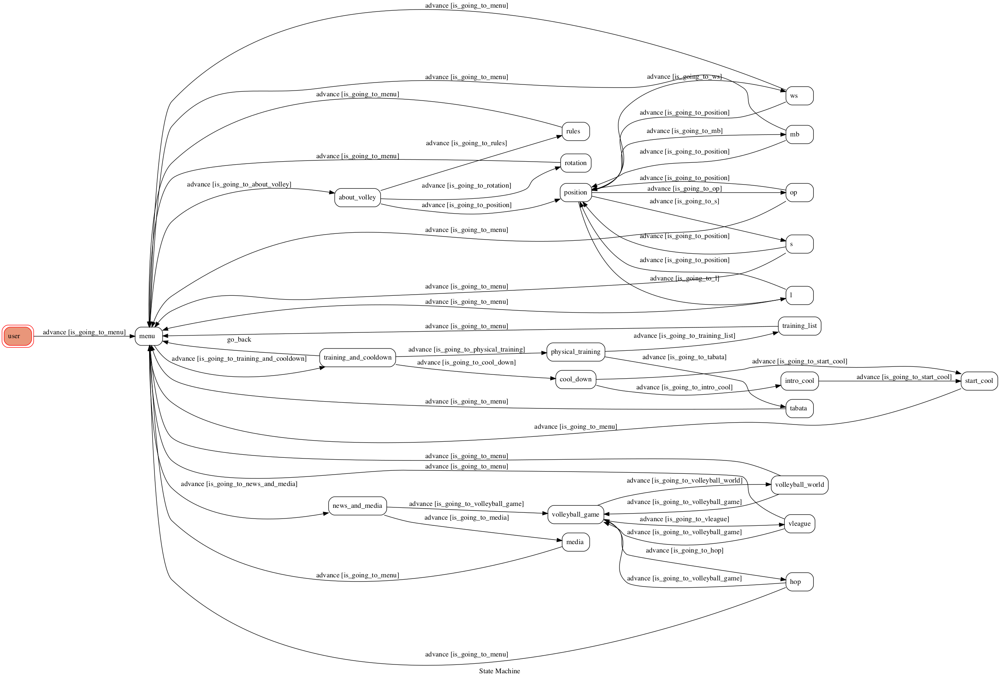

# Little Haikyuu 小排球

>Final Project for TOC Project 2022 
>
>Finish on December 25th, 2022
>
>A Line bot based on a finite state machine (FSM)

## 設計主旨
排球運動一直以來都非常受歡迎。在學校與企業中都不乏有投入排球的人。而排球訓練，除了日常練習外，其實也有諸多需要注意的地方。

例如：如何正確收操、體能菜單怎麼排、系隊吹裁忘記規則、想關注排球時事等等

以上都是一些較瑣碎的事情，需要個別查找實在過於麻煩。因此設計了一個 LineBot，提供一個能快速得到以上資訊的環境。

（其實排球訓練以及訓練外的需求因人而異，因此本作品可能有強烈的個人色彩。是由此 LineBot 設計者本人出發而展開的設計）

## 介紹
### 基本資訊


名稱：小排球（英文：Little Haikyuu）
麻煩掃 QRCode 加入好友呦～


>🔺 由於本 LineBot 使用 Selenium 進行爬取 YouTube 的作業，在部署上較為困難。加上 Heroku 現在需要付費等等原因⋯⋯
>
>本次實作將在本地操作。

```
ngrok http 8000
```
```
python3 app.py
```
### 使用技術
>BeautifulSoup 爬取一般網頁資訊（「比賽規則」的部分）
>
>Selenium 爬取 YouTube 個頻道的最新影片
>
>媒體加分：Tabata 的音樂部分（音樂有點長，可能會 loading 一段時間）

### 功能


加入好友後會看到歡迎訊息，在聊天室輸入「主選單」即可看到功能列表。

以下我們先介紹整體架構

### 整體架構

除了最一開始的輸入「主選單」的部分，使用者皆不需（打字很麻煩，當然如果喜歡打字也可以），只要依照指示按按鈕即可。

>關於排球 （介紹排球位置、規則）
>
>>球員站位與介紹（有一張站位圖，點選圖片就能看到該位置的球員介紹）
>>>MB 中間攔網手
>>>
>>>S 舉球員
>>>
>>>WS 主攻手
>>>
>>>OP 舉對、接應
>>>
>>>L 自由球員
>>>
>>比賽規則（使用 BeautifulSoup 爬取網頁）
>>
>>輪轉規則
>>
>體能與收操
>
>>球員體能訓練（文字框 塔巴塔還是 排球體能菜單）
>>
>>>塔巴塔（Tabata 的推薦菜單，影片連結，超酷音樂）
>>>
>>>排球體能菜單（基礎肌力、初級專項體能、進階專項體能）
>>>
>>收操很重要
>>>收操小科普（去「開始收操」）
>>>
>>>開始收操
>>>
>時事收集與媒體
>
>>排球比賽（使用 Selenium，YouTube爬蟲）
>>
>>>HOP Sports 各一個list 
>>>
>>>V.LEAGUE
>>>
>>>Volleyball World
>>>
>>排球推薦帳號（列表）

```
圖片由Pinterest、YouTube 封面、Google搜尋、Twitter 提供
版面配置的部分使用 Line Developer 提供的 Flex Message Simulator
```


## 實作截圖與講解
### Prerequisite
* Python 3.6
* Pipenv
* Facebook Page and App
* HTTPS Server

#### Install Dependency
```sh
pip3 install pipenv

pipenv --three

pipenv install

pipenv shell
```

* pygraphviz (For visualizing Finite State Machine)
    * [Setup pygraphviz on Ubuntu](http://www.jianshu.com/p/a3da7ecc5303)
	* [Note: macOS Install error](https://github.com/pygraphviz/pygraphviz/issues/100)


#### Secret Data
You should generate a `.env` file to set Environment Variables refer to our `.env.sample`.
`LINE_CHANNEL_SECRET` and `LINE_CHANNEL_ACCESS_TOKEN` **MUST** be set to proper values.
Otherwise, you might not be able to run your code.

#### Run Locally
You can either setup https server or using `ngrok` as a proxy.

#### a. Ngrok installation
* [ macOS, Windows, Linux](https://ngrok.com/download)

or you can use Homebrew (MAC)
```sh
brew cask install ngrok
```

**`ngrok` would be used in the following instruction**

```sh
ngrok http 8000
```

After that, `ngrok` would generate a https URL.

#### Run the sever

```sh
python3 app.py
```

#### b. Servo

Or You can use [servo](http://serveo.net/) to expose local servers to the internet.


## Finite State Machine


## Usage
The initial state is set to `user`.

Every time `user` state is triggered to `advance` to another state, it will `go_back` to `user` state after the bot replies corresponding message.

* user
	* Input: "go to state1"
		* Reply: "I'm entering state1"

	* Input: "go to state2"
		* Reply: "I'm entering state2"

## Deploy
Setting to deploy webhooks on Heroku.

### Heroku CLI installation

* [macOS, Windows](https://devcenter.heroku.com/articles/heroku-cli)

or you can use Homebrew (MAC)
```sh
brew tap heroku/brew && brew install heroku
```

or you can use Snap (Ubuntu 16+)
```sh
sudo snap install --classic heroku
```

### Connect to Heroku

1. Register Heroku: https://signup.heroku.com

2. Create Heroku project from website

3. CLI Login

	`heroku login`

### Upload project to Heroku

1. Add local project to Heroku project

	heroku git:remote -a {HEROKU_APP_NAME}

2. Upload project

	```
	git add .
	git commit -m "Add code"
	git push -f heroku master
	```

3. Set Environment - Line Messaging API Secret Keys

	```
	heroku config:set LINE_CHANNEL_SECRET=your_line_channel_secret
	heroku config:set LINE_CHANNEL_ACCESS_TOKEN=your_line_channel_access_token
	```

4. Your Project is now running on Heroku!

	url: `{HEROKU_APP_NAME}.herokuapp.com/callback`

	debug command: `heroku logs --tail --app {HEROKU_APP_NAME}`

5. If fail with `pygraphviz` install errors

	run commands below can solve the problems
	```
	heroku buildpacks:set heroku/python
	heroku buildpacks:add --index 1 heroku-community/apt
	```

	refference: https://hackmd.io/@ccw/B1Xw7E8kN?type=view#Q2-如何在-Heroku-使用-pygraphviz

## Reference
[Pipenv](https://medium.com/@chihsuan/pipenv-更簡單-更快速的-python-套件管理工具-135a47e504f4) ❤️ [@chihsuan](https://github.com/chihsuan)

[TOC-Project-2019](https://github.com/winonecheng/TOC-Project-2019) ❤️ [@winonecheng](https://github.com/winonecheng)

Flask Architecture ❤️ [@Sirius207](https://github.com/Sirius207)

[Line line-bot-sdk-python](https://github.com/line/line-bot-sdk-python/tree/master/examples/flask-echo)
